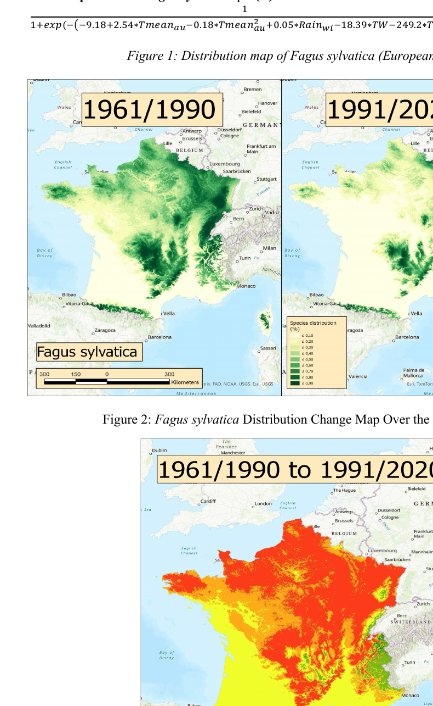
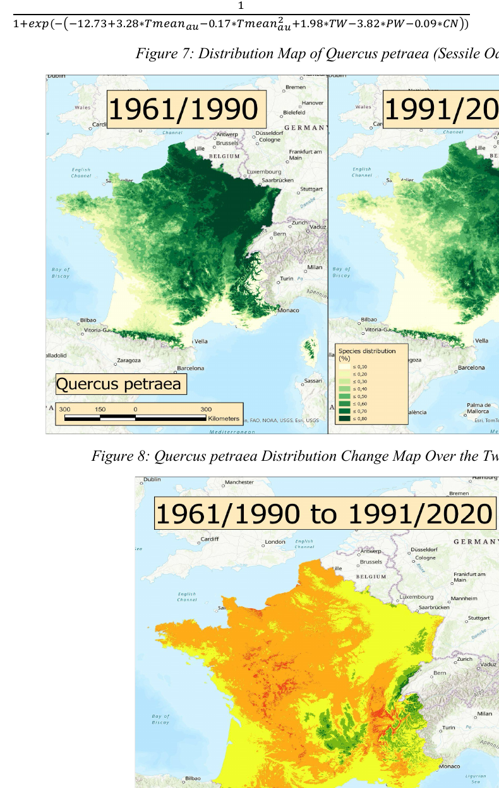

# Forest Species Distribution Models in France

A reproducible forest-modelling portfolio project exploring changes in habitat suitability for **European beech** (*Fagus sylvatica*) and **sessile oak** (*Quercus petraea*) in France across two climate periods:

```text
1961-1990
1991-2020
```

The repository combines:

- a cleaned R workflow for logistic-regression species distribution modelling;
- reproducible validation outputs;
- map previews;
- a full scientific report describing the comparative ArcGIS analysis.

## Project author

**Huy Quang Bui**  
Forestry | Forest Modelling | Geospatial Analytics | R & Python

## Research focus

The study evaluates whether climate and soil-related variables are associated with changes in suitable habitats for two temperate forest species.

The analytical workflow includes:

```text
forest plot data
→ data-quality checks
→ correlation analysis
→ predictor screening
→ logistic-regression SDM
→ ROC/AUC validation
→ partial-response curves
→ ArcGIS suitability maps
→ comparison between climate periods
```

## Report

The complete scientific report is available here:

[Download the Species Distribution Models report](docs/species-distribution-models-report.pdf)

The report compares habitat-suitability patterns for both species and documents the ArcGIS map outputs, response curves, and ROC results.

## Map previews

### European beech (*Fagus sylvatica*)

The report compares modelled suitability for 1961-1990 and 1991-2020 and includes a distribution-change map.



### Sessile oak (*Quercus petraea*)

The report also compares historical and contemporary suitability for sessile oak and includes a distribution-change map.



## Key reported results

The collaborative report presents:

| Species | Reported validation AUC | Reported sensitivity | Reported specificity |
|---|---:|---:|---:|
| European beech (*Fagus sylvatica*) | 0.8305 | 0.7923 | 0.7296 |
| Sessile oak (*Quercus petraea*) | 0.7878 | 0.8237 | 0.6315 |

The report discusses temperature and moisture-related drivers, highlighting a stronger apparent shift in suitable habitat for European beech and the importance of soil-moisture conditions for sessile oak.

## Repository structure

```text
forest-species-distribution-models-france/
├── README.md
├── LICENSE
├── .gitignore
├── scripts/
│   └── 01_beech_logistic_regression.R
├── docs/
│   └── species-distribution-models-report.pdf
├── figures/
│   ├── beech-map-preview.png
│   └── oak-map-preview.png
├── data/
│   └── README.md
└── outputs/
    ├── README.md
    ├── figures/
    └── tables/
```

## R workflow

The cleaned R script currently focuses on the beech logistic-regression workflow:

```text
scripts/01_beech_logistic_regression.R
```

Its configurable final model terms are:

```r
final_model_terms <- c(
  "Tmean_au",
  "I(Tmean_au^2)",
  "TW",
  "PW",
  "CN"
)
```

Update the configuration section if you want to reproduce another species-specific model.

## Requirements

Install R and the required packages:

```r
install.packages(c("dplyr", "pROC"))
```

## Input data

Place the private input dataset here:

```text
data/database_ed.csv
```

The raw forest-plot dataset is intentionally excluded from this public repository.

## How to run

Open R or RStudio from the repository root and run:

```r
source("scripts/01_beech_logistic_regression.R")
```

Generated outputs will be saved under:

```text
outputs/figures/
outputs/tables/
```

## Data confidentiality

Do not upload private forest-inventory data, restricted rasters, or sensitive location data unless you have permission to publish them. The `.gitignore` file excludes private input files and generated model outputs.

## Report authorship and acknowledgements

The scientific report included in this repository is a collaborative coursework report written by:

- Huy Quang Bui
- Irene Chiagozielam Onwunji
- Mathieu Legay
- Mung Htoi Aung
- Nacer Nafea
- Romulo Soares Gomes de Oliveira

The project was completed for the AgroParisTech course **9.14 - Models for Forest Research and Management** under the supervision of **Christian Piedallu**.

The cleaned repository structure and reproducible code organisation were prepared by **Huy Quang Bui**. The R workflow is adapted from an earlier forest-science teaching script credited to C. Piedallu (2024).
